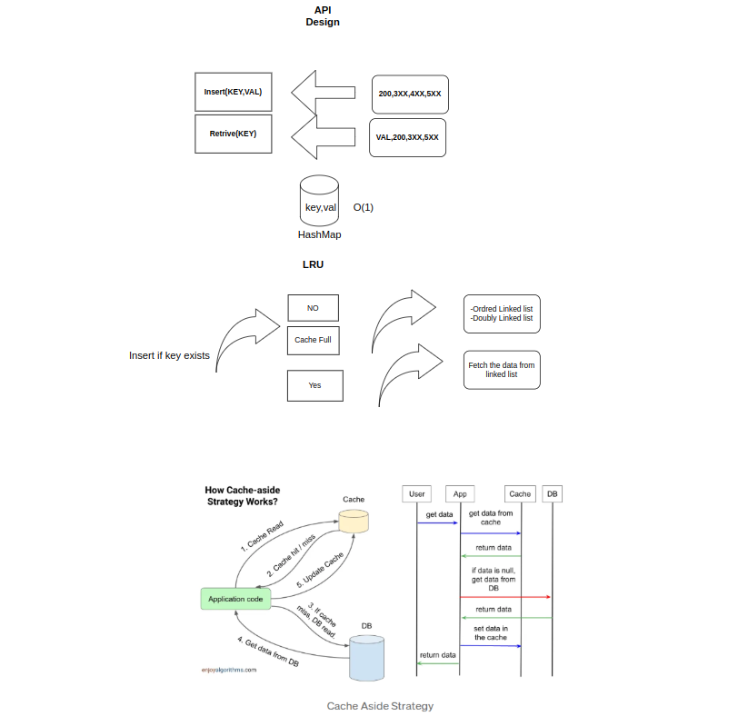
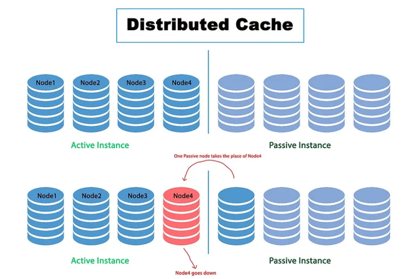

# LRU Cache Golang API

This project implements a Least Recently Used (LRU) Cache as a REST API using Go (Golang). The API allows clients to interact with the cache by performing operations such as adding, retrieving, and evicting cache entries.




## Features

- Add key-value pairs to the cache
- Retrieve values by key
- Automatic eviction of least recently used entries when the cache reaches its capacity

## Getting Started

### Prerequisites

- [LeetCode](https://leetcode.com/problems/lru-cache/description/)
- [Solution](https://github.com/Sagor0078/lru-cache-golang-api-design/lru_cache.go)
- Go 1.16 or higher
- Git

### Installation

1. Clone the repository:
    ```sh
    git clone https://github.com/Sagor0078/lru-cache-golang-api.git
    cd lru-cache-golang-api
    ```

2. Build the project:
    ```sh
    go build -o lru-cache-api ./src
    ```

3. Run the server:
    ```sh
    ./lru-cache-api
    ```

### API Endpoints

#### Add a key-value pair

- **URL:** `/cache`
- **Method:** `POST`
- **Request Body:**
    ```json
    {
        "key": "example_key",
        "value": "example_value"
    }
    ```
- **Response:**
    ```json
    {
        "message": "Key-value pair added successfully"
    }
    ```
- **Curl Command:**
    ```sh
    curl -X POST http://localhost:8080/cache -H "Content-Type: application/json" -d '{"key":"example_key", "value":"example_value"}'
    ```

#### Retrieve a value by key

- **URL:** `/cache/{key}`
- **Method:** `GET`
- **Response:**
    ```json
    {
        "key": "example_key",
        "value": "example_value"
    }
    ```
- **Curl Command:**
    ```sh
    curl http://localhost:8080/cache/example_key
    ```